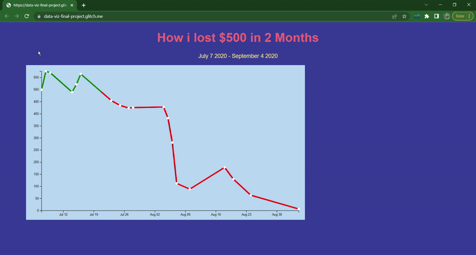

# Data Driven interactive chart

A simple HTML, CSS and JS application that shows my initial first few months of trading in a interactive chart using a javascript framework D3.js.

## features

- a interactive chart build in glitch
- a simple and easy interface using D3.js

### Walkthrough

### Technologies

- HTML, CSS & JS
- d3js (interactive data)
- Glitch
- DOM Manipulation
